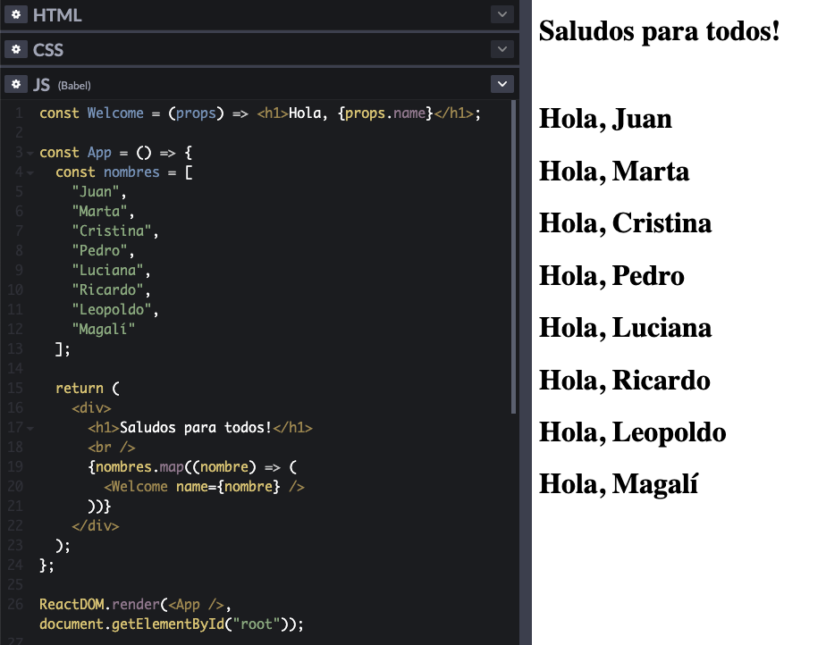
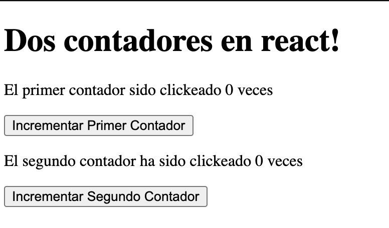

# React

> NOTA: A lo largo de este escrito va a haber ejemplos con referencias a 'codepen'. Codepen es una herramienta para compartir fragmentos de código, al acceder a los ejemplos con estos links, vas a poder ver y modificar el código, y ademas, los efectos de los cambios casi instantaneamente desde tu navegador.
---
## ¿Qué es React?

Según el [sitio oficial](https://reactjs.org/):

```
React es una librería de JavaScript para construir interfaces.
```

Esta simple definición es importarte para no perdernos, react es una librería con el propósito de asistirnos en la creacion de vistas.

En la practica se utiliza en conjunto a un montón de otros extras y herramientas lo que a veces lo hace parecer mucho más complejo e intimidante a la hora de aprender.

En su forma mas simple podemos utilizar react en una página html a través de tags `<script></script>` que referencien las librerias de `react` y `react-dom`. Luego tan solo tenemos que empezar a escribir nuestros componentes de react.


> NOTA: El código fuente se puede ver [acá](ejemplos/react-html.html), tambien podés mirarlo en vivo en [CODEPEN](https://codepen.io/leandamarill/pen/poNWgmQ). Este ejemplo se basa en el expuesto en la documentación sobre [como agregar react a un sitio existente](https://reactjs.org/docs/add-react-to-a-website.html#add-react-in-one-minute)
---
## JSX

Llegamos a nuestro primer `extra` de React. JSX significa JavaScript XML, su trabajo es producir 'elementos de React' que nos permite renderizarlos y colocarlos en el DOM de manera más sencilla.

Podríamos considerarlo como [azúcar sintáctico](https://es.wikipedia.org/wiki/Az%C3%BAcar_sint%C3%A1ctico) para no utilizar alguna de las funciones de react directamente.

Es importante aclarar que no es estrictamente necesario utilizar JSX par ausar React, pero es MUY conveniente y en la práctica es practicamente imposible no verlos juntos.

#### Ejemplo con JSX

```js
const miElemento = <h1>Me gusta usar JSX!</h1>;

ReactDOM.render(miElemento, document.getElementById("root"));
```

#### Ejemplo sin JSX

```js
const miElemento = React.createElement(
  "h1",
  {},
  "No uso JSX porque me gusta escribir mucho innecesariamente!"
);

ReactDOM.render(miElemento, document.getElementById("root"));
```

> NOTA: En ambos casos se utiliza la llamada a ReactDOM.render, esta simplemente se encarga de renderizar el primer elemento como hijo del segundo elemento del DOM (en ese caso se esta buscando el elemento con id 'root' que suele ser un `div` sin contenido).

### ¿Por qué JSX?

React acepta el hecho de que la lógica de renderizado está intrínsecamente unida a la lógica de la interfaz de usuario: cómo se manejan los eventos, cómo cambia el estado con el tiempo y cómo se preparan los datos para su visualización.

En lugar de separar artificialmente tecnologías poniendo el maquetado y la lógica en archivos separados, React separa [intereses](https://es.wikipedia.org/wiki/Separaci%C3%B3n_de_intereses) con unidades ligeramente acopladas llamadas `componentes` que contienen ambas.

### Lo bueno de usar JSX

Una ventaja de utilizar JSX es que podemos colocar cualquier expresión de JavaScript mediante el uso de llaves `{}`. Estas expresiones se evaluan y al momento de ser renderizadas lo que se visualiza es el resultado obtenido.

Por ejemplo, este página muestra siempre la hora en la que se renderizó:

```js
const element = (
  <h1>Hola! La fecha en este momento es {new Date().toString()}</h1>
);

ReactDOM.render(element, document.getElementById("root"));
```

> [Expresiones en JSX - CODEPEN](https://codepen.io/leandamarill/pen/zYoEqPq)

El uso de las llaves no solo esta limitado a expresiones de JavaScript sinó que tambien podemos devolver otros elementos de JSX. En la siguiente imagen componemos los dos elementos de ejemplos anteriores en no solo

```js
const miElementoConJSX = <h2>Me gusta usar JSX!!</h2>;
const miElementoSinJSX = React.createElement(
  "h2",
  {},
  "No uso JSX porque me gusta escribir mucho innecesariamente!"
);

// La sintaxis con '{}' es la que nos permite insertar los dos elementos
const elementoContenedor = (
  <div>
    {miElementoConJSX}
    <br />
    {miElementoSinJSX}
  </div>
);

ReactDOM.render(elementoContenedor, document.getElementById("root"));
```

> [JSX en JSX - CODEPEN](https://codepen.io/leandamarill/pen/gOLGrej)


Un derivado de poder mostrar elementos JSX es poder elegir un componente u otro en base a lógica definida en JavaScript, este concepto lo vamos a escuchar nombrado como 'renderizado condicional'.

```js
const meGustaJSX = true;
const elementoConRenderizadoCondicional = (
  <div>
    {meGustaJSX && miElementoConJSX}
    {!meGustaJSX && miElementoSinJSX}
  </div>
);
```

> [Renderizado condicional en JSX - CODEPEN](https://codepen.io/leandamarill/pen/yLVzOyw)


Además de los ejemplos que fuimos mencionando, JSX nos presenta algunas otras bondades como ayudarnos a prevenir vulnerabilidades XSS escapando contenido antes de renderizarlo. Estás no son relevantes para nosotros en este momento pero [acá](https://es.reactjs.org/docs/introducing-jsx.html) pueden leer un poco mas sobre JSX.

### Lo 'malo' de usar JSX

JSX tiene una desventaja que de no ser facilmente solucionable sería fatal.

```
JavaScript puro no sabe que hacer con JSX
```

Si bien algunos navegadores como versiones recientes de Chrome pueden llegar a entender nuestro JSX, para garantizar que todos lo navegadores puedan hacerlo necesitamos ayuda de un pre-procesador de JavaScript.

Uno de estos pre-procesadores es `Babel` que es capaz de convertir nuestro codigo en javascript puro


Algo a aclarar es que durante el cursado no configuraremos nada relacionado a babel ya que las herramientes utilizadas lo hacen por nosotros.

## Elementos de React

Los elementos son los bloques mas pequeños que componen aplicaciones React. Describen lo que uno quiere ver en la vista

```js
const element = <h1>Hello, world</h1>;
```

A diferencia de los elementos del DOM del browser, los elementos de React son objetos. React DOM se encarga de actualizar el DOM real para que refleje los elementos de React.

### React DOM vs DOM real

Al concepto de DOM (Document Object Model) estándar que representa los documentos HTML, react suma su propia abstracción del DOM conocida como DOM Virtual o VDOM.

Lo importante a destacar es que React **solo actualiza lo que es necesario**. Para lograr esto, ante un cambio, compara los elementos y los hijos del estado anterior del DOM y solo actualiza aquellos elementos necesarios para que lograr el nuevo estado deseado.

> Los detalles de implementación no son necesarios para el cursado pero pueden verse [en la documentación](https://es.reactjs.org/docs/faq-internals.html#what-is-the-virtual-dom) para aquellos interesados.

## Componentes

Ya hemos mencionado un par de veces la palabra `componentes`, esto se debe a que en React definimos nuestras vistas con una estrategia basada en componentes encapsulados que manejan su propio estado interno que se utilizan en conjunto para construir interfaces graficas complejas.

Un componente no es mas qué una clase o función de JavaScript que acepta entradas o propiedades (o `props` como se suele abreviar) y retorna un elemento de React que describe como una sección de la interfaz gráfica debería verse.

> NOTA: Los componentes son la razon por la que react habla de un enfoque `declarativo`. En lugar de mutar la interfaz grafica nosotros mismos para que este en sincronía con el modelo lógico (enfoque imperativo), en react, son nuestros componentes los cuales a partir del modelo lógico (o estado), derivan la representación visual correspondiente.

Existen dos formas de declarar componentes

- Componente funcional

  ```js
  // Como función tradicional
  function Welcome(props) {
    return <h1>Hola, {props.name}</h1>;
  }

  // Como función flecha (Javascript ES6)
  const Welcome = (props) => <h1>Hola, {props.name}</h1>;
  ```

- Componente de clase
  ```js
  // Clase (Javascript ES6)
  class Welcome extends React.Component {
    render() {
      return <h1>Hola, {this.props.name}</h1>;
    }
  }
  ```

Si bien ambos componentes son equivalentes desde el punto de vista de React, desde la introducción de [hooks en React 16.8](https://es.reactjs.org/docs/hooks-intro.html) se recomienda escribir componentes funcionales ya que suele resultar en código más conciso y legible.

### Renderizado de componentes

Anteriormente vimos elementos de react que representaban tags HTML.

```JS
const element = <div />;
```

Nuestros componentes de React también pueden ser representados por elementos de la siguiente manera.

```js
const nombre = "Juan";
const element = <Welcome name={nombre} />;
```

> [Componente de React - CODEPEN](https://codepen.io/leandamarill/pen/BaQwLpp)

Si prestamos atención `Welcome` es el componente que definimos anteriormente.

React necesita distinguir entre los elementos nativos y los que definimos nostros para saber como renderizarlos y con ese fin nos impone la siguiente regla

```
Los nombres de todos los componentes de React deben comenzar con mayúscula.
```

> Si no respetamos esta regla encontraremos varios errores ya que React asumirá que queremos renderizar elementos nativos.

Ademas, el componente `Welcome` esta recibiendo `name` como parte de sus props, estas props nos ayudan a indicarle al componente que hacer y como verse lo que nos da mucha flexibilidad para diseñar componentes que puedan ser reutilizables en multiples lugares de nuestra aplicación.

### Reusando componentes

Es importante escribir nuestros componentes de manera que podamos reutilizarlos desde otros. Recordemos que una de los pilares mas importantes de React es el de construir interfaces complejas a travez de la composición de elementos simples.

```js
const Welcome = (props) => <h1>Hola, {props.name}</h1>;

const App = () => {
  const nombres = [
    "Juan",
    "Marta",
    "Cristina",
    "Pedro",
    "Luciana",
    "Ricardo",
    "Leopoldo",
    "Magalí",
  ];

  return (
    <div>
      <h1>Saludos para todos!</h1>
      <br />
      {nombres.map((nombre) => (
        <Welcome name={nombre} />
      ))}
    </div>
  );
};

ReactDOM.render(<App />, document.getElementById("root"));
```

> [Componentes en Componentes - CODEPEN](https://codepen.io/leandamarill/pen/RwoLGZa)



### Props en componentes

Los componentes pueden recibir valores que le indiquen que renderizar, estos se encuentran dentro un objeto denomidado `props`.

El uso de `props` permite el reuso de los mismos componentes en distintos lugares de nuestra aplicación brindandonos gran flexibilidad.

Por ejemplo, un componente `Articulo` podría estar definido de la siguiente forma destructurando sus props

```js
function Articulo({autor, titulo, contenido, fecha}) {
  return (
    /* Representación del componente*/
  )
}
```

Y luego para reutilizarlo podríamos simplemente hacer

```js
<Articulo
  autor="Juan Carlos"
  titulo="lorem ipsum"
  contenido="Lorem ipsum dolor sit amet, consectetur adipiscing elit, sed do eiusmod tempor incididunt ut labore et dolore magna aliqua"
  fecha={new Date()}
/>
```

O bien tambien podríamos usarlo para generar una lista de articulos de la siguiente forma

```js
{
  articulos.map((a) => (
    <Articulo
      autor={a.autor}
      titulo={a.titulo}
      contenido={a.contenido}
      fecha={a.fecha}
    />
  ));
}
```

Algo importante a destacar es que las props traen consigo una restricción y es que un componente **nunca debe modificar sus props** asi que podemos definir otra regla

```
Para un componente sus props son de solo lectura.
```

Esto asegura que un componente padre pueda enviar parametros por props a sus componentes hijos y estos no puedan modificarlos evitando así obtener resultados inesperados.

### Estado en componentes (useState)

Si bien un componente no puede modificar los props que recibe, todo componente puede definir su propio estado interno. Este estado interno puede luego utilizarlo para saber como renderizarse o para pasarselo por props a algun componente hijo que posea (los cuales no podran modificarlos, ya que sera parte de las props que recibe).

> **¿Cuál es la diferencia entre state y props?**
>
> Props (abreviatura de ”properties”) y state son objetos planos de JavaScript. Mientras ambos contienen información que influye en el resultado del render, son diferentes debido a una importante razón: props se pasa al componente (similar a los parámetros de una función) mientras que state se administra dentro del componente (similar a las variables declaradas dentro de una función) - Extraido de la [documentación de react](https://es.reactjs.org/docs/faq-state.html#what-is-the-difference-between-state-and-props).

Antes de la introducción de hooks en React 16.8 la única forma de construir componentes con estado interno (o state) era mediente componentes de clase. Ahora podemos hacerlos incluso desde componentes funcionales.

La forma de definir estado en un componente funcional es a travez del hook `useState` importandolo desde la librería de react.

```js
import React, { useState } from "react";

const [contador, setContador] = useState(0);
```

La llamada recibe como parametro el estado inicial y devuelve una tupla donde el primer parametro es el valor actual y el segundo es una función para modificarlo, usando la desestructuración de arrays de javascript es que podemos ponerles nombres como `contador` y `setContador` que sean significativos para nuestra aplicación.

En primer lugar pareceria tener poco sentido, porque usar `useState` si puedo definir mi propia constante para el contador, no? La diferencia esta que de haber esto hecho react jamás se enteraría que debe volver a renderizar la vista cuando el valor del contador cambia, Al usar la funcion `setContador`, react modifica el valor de `contador` y luego sabe que necesita re-renderizar para que la vista el estado se mantengan en sincronía.

Así es que podemos definir un contador en un componente de react de la siguiente manera.

```js
import React, { useState } from "react";

function Contador() {
  const [contador, setContador] = useState(0);
  return (
    <div>
      <h1>Soy un contador en react!</h1>
      <p>Actualmente me han clickeado {contador} veces</p>
      <button onClick={() => setContador(contador + 1)}>Incrementar</button>
    </div>
  );
}
```
%%
%%

> [Contador - CODEPEN](https://codepen.io/leandamarill/pen/qBqJBVM)

### El hook de useEffect en componentes
> Al final de la explicación hay un 'machete' para uso cotidiano

#### Explicación

Este hook es uno de los mas importantes, lamenteablemente la definición no es lo más sencillo de explicar sin entrar a explicar la vieja api de clases y métodos de ciclo de vida.

La definición de react dice:

```
El Hook useEffect te permite llevar a cabo "efectos secundarios" en componentes funcionales
```

Los `efectos secundarios` son todas aquellas operaciones que no pueden realizarse durante el renderizado como suscripciones/desuscripciones de eventos o recuperar datos de internet cuando se carga nuestro componente o un valor de interés se modifica.

Al usar este Hook, le estamos indicando a React que el componente tiene que hacer algo después de renderizarse. React recordará la función que le hemos pasado (nos referiremos a ella como nuestro “efecto”), y la llamará más tarde después de actualizar el DOM. 

Por defecto se ejecuta después del primer renderizado y después de cada actualización. La api nos permite modificar este comportamiento utilizando un _array de dependencias_ que explicaremos luego.


La forma de definir un effecto en un componente funcional es a travez del hook `useEffect` importandolo desde la librería de react. Este recibe como primer argumento una función que contiene nuestro efecto

```js
import React, { useState } from "react";

useState(() => {
 // nuestro codigo a ejecutar
});
```

Esto permite que podamos acceder al estado del componente de forma transparente. En este caso la función alert se ejecutará luego de cada renderizado.

```js
import React, { useState } from "react";

// Ejemplo de componente
function Contador() {
  const [contador, setContador] = useState(0);
  
  useEffect(()=>{
  // Alert abre una ventana del navegador con nuestro mensaje
   alert(`Actualmente me han clickeado ${contador} veces`)
  });
  
  // Resto del componente...
}

```
> [Contador - useEffect sin deps - CODEPEN](https://codepen.io/leandamarill/pen/wvJLBJd)

Al definir nuestro efectos también podemos opcionalmente definir como hacer **cleanup** (o limpieza) haciendo que nuestro efecto retorne una segunda función que se ejecutará para realizar este comportamiento. 

Este tipo de efectos es muy comun utilizarlos cuando nos suscribimos a algun evento y queremos asegurarnos de desuscribirnos cuando ya no sea necesario.

##### Ejemplo de cleanup
Partiendo de nuestro código anterior que muestra un alert en cada click. Si quisieramos esperar un **1 segundo** desde la ultima vez quese apreto el botón antes de mostrar el mensaje podríamos arrancar de la siguiente manera.

Envolviendo la llamada de `alert`  utilizando  `setTimeout` 

```js
  useEffect(() => {
    setTimeout(() => {
      alert(`Actualmente me han clickeado ${contador} veces`);
    }, 1000);
  });
```

Ahora, si apretamos muchas veces el botón de incrementar el contador veremos que luego de un segundo empiezan a abrirse multiples ventanas de alerta.

> [Contador - useEffect sin deps con setTimeout - CODEPEN](https://codepen.io/leandamarill/pen/wvJLaVb)

Esto sucede porque con cada vez que presionamos el botón estamos creando un nuevo timeout y no estamos **limpiando** el anterior. 

En realidad, la api del browser `setTimeout` devuelve el id del timeout que se creo y también existe una api `clearTimeout(timeoutID)` que podemos utilizar para limpiarlo. 

Refactorizando nuestro effect para usar cleanup entonces obtendríamos

```js
  useEffect(() => {
    const timeout = setTimeout(() => {
      alert(`Actualmente me han clickeado ${contador} veces`);
    }, 1000);
	
	return () => {
      clearTimeout(timeout);
	}
  });
```

Ahora podemos presionar muchas veces el botón de incrementar el contador pero el mensaje de alerta no aparecerá hasta sino hásta luego de 1 segundo de que dejemos de presionar. Esto sucede porque antes de crear el nuevo timeout, estamos ejecutando `clearTimeout` en el anterior.

[Contador - useEffect sin deps con setTimeout y cleanup - CODEPEN](https://codepen.io/leandamarill/pen/JjWQYXM)


##### Ejecutando nuestro efecto de forma selectiva

Hasta ahora menciónamos los efectos con y sin cleanup después de cada actualización. En algunos casos, ejecutar el cleanup o aplicar el efecto después de cada renderizado puede crear problemas de rendimiento.

Este requerimiento es tan común que está incorporado en la API del _Hook_ `useEffect`. Puedes indicarle a React que _omita_ aplicar un efecto si ciertos valores no han cambiado entre renderizados. Para hacerlo, pasa un array como segundo argumento opcional a `useEffect`:

```js
// Solo ejecutamos este efecto si contador se modificó
useEffect(()=>{
	alert(`Actualmente me han clickeado ${contador} veces`)
},[contador]);
```

> **TIP**
>
> A veces queremos que un efecto se ejecute solo una vez, al montarse el componente y su limpieza se ejecute al momento de desmontarse. Para estos casos podemos usar un array vacio como dependencias.
> ```js
> useEffect(()=>{
>	// Ejecuta cuando monta
>	return ()=> {
>	  // Ejecuta cuando desmonta (opcional)
>	}
>},[]);
>```

###### Ejemplo de dependencias en nuestros efectos

Imaginemos un segundo contador con su correspondiente botón para incrementarlo. Si miramos la siguiente interfaz y su codigo podría ser similar a lo siguiente.



```js
function Contadores() {
  const [contador, setContador] = useState(0);
  const [segundoContador, setSegundoContador] = useState(0);

  useEffect(() => {
    alert(`El valor del primer contador: es ${contador}`);
  });

  return (
    <div>
      <h1>Dos contadores en react!</h1>
      <p>El primer contador sido clickeado {contador} veces</p>
      <button onClick={() => setContador(contador + 1)}>
        Incrementar Primer Contador
      </button>
      <p>El segundo contador ha sido clickeado {segundoContador} veces</p>
      <button onClick={() => setSegundoContador(segundoContador + 1)}>
        Incrementar Segundo Contador
      </button>
      <br />
    </div>
  );
}
```

> [Dos contadores - useEffect sin deps - CODEPEN](https://codepen.io/leandamarill/pen/QWpXjzG)

Observemos que si no hacemos ningun otro cambio, cualquiera de los dos botones modificará el state de nuestro componente, lo cual hará que se re-renderice y que luego ejecute una llamada a nuestro `useEffect` que muestra una alerta con el valor de `contador` el cual para los casos de haber apretado el **segundoContador** será el mismo valor. 

Muchas veces este no es el comportamiento deseado. imaginemos un campo de busqueda que al tipear caracteres hacen una consulta a backend para traer resultados, si el contenido del campo no cambio podríamos evitar volver a hacer esta consulta.

Para esto existe el segundo parametro opcional de `useEffect`, si modificamos la llamada del hook a la forma

```js
  useEffect(() => {
    alert(`El valor del primer contador: es ${contador}`);
  },[contador]);
```

Ahora efecto solo se ejecutará para los casos que `contador` se haya modificado sin importar lo que pase con `segundoContador`.

> [Dos contadores - useEffect CON deps - CODEPEN](https://codepen.io/leandamarill/pen/NWpZxPd)


#### Machete useEffect

Algunos usos comunes de este hook son los siguientes (recordar que en cada caso podriamos retornar una función)

```js
// Ejecutar luego de cada re-render
useEffect(() => {
  // ...
  // Opcional: return función de cleanup
});

// Ejecutar luego de cada re-render si el valor 'miVariable' se modificó
const [miVariable, setMiVariable] = setState(null);
useEffect(() => {
  // ...
  // Opcional: return función de cleanup
},[miVariable]);

// Ejecutar luego de cada re-render si el valor 'miVariable' o 'miOtraVariable' se modificó
const [miVariable, setMiVariable] = setState(null);
const [miOtraVariable, setMiOtraVariable] = setState(null);
useEffect(() => {
  // ...
  // Opcional: return función de cleanup
},[miVariable, miOtraVariable]);

// Ejecutar una vez cuando se monta el componente
const [miVariable, setMiVariable] = setState(null);
useEffect(() => {
  // ...
  // Opcional: return función de cleanup que se ejecuta cuando se desmonta el componente
},[]);


```


### Pensando en React

Una de las grandes ventajas de React es cómo te hace pensar acerca de la aplicación mientras la construyes.

La documentación hace bastante incapié en algunas 'reglas de mano' para escribir aplicaciones react, a continuación haremos un breve resumen de dos puntos de la [publicacion completa](https://es.reactjs.org/docs/thinking-in-react.html).

##### Dividir la interfaz de usuario en una jerarquía de componentes
Nuestras UIs en react deben ser pensada como un conjunto de pequeños componentes reusables que componen nuestras pantallas. Los componentes pequeños son faciles de debuggear y de escribir test unitarios.

Para saber que debería ser su propio componente una buena técnica es basarse el principio de **responsabilidad única** esto significa que un componente debe, idealmente, hacer solo una cosa. Si termina creciendo entonces debería ser dividido en componentes más pequeños.

##### Identificar dónde debe vivir el estado

En React se trata de usar un flujo de datos en un sentido descendiente. Para esto buscamos respetar lo siguiente
- El estado de un componente, si no necesita ser accedido por un componente hermano, debe ser parte de el.
- Si un componente hijo necesita un valor que es parte del estado de un componente más arriba de la jerarquía deberá recibirlo por props.
- Si dos componentes hermanos necesitan acceder al mismo valor este debería ser parte del estado de un componente común a estos más arriba en la jerarquía, el cual les proporciona acceso al valor mediante props (esto se conoce como [levantar el estado](https://es.reactjs.org/docs/lifting-state-up.html)).

Puede que no sea inmediatamente obvio cuál componente debería poseer el estado. **Esta es normalmente la parte más complicada para quienes están arrancando con React**

## Next.js como framework para React

Hasta ahora estuvimos utilizando React accediendo a las librerias mediante una referencia a la cdn con el código, si bien para nuestros ejemplos fue suficiente no es la mejor solución para crear una aplicación completa con React desde cero.

Una alternativa sería configurar nuestro propio proyecto de npm, utilizando algun bundler como **webpack** y transformando nuestro código con **Babel**.

La otra opción es apoyarse en alguna herramienta para generar nuestro proyecto de React como [create-react-app](https://create-react-app.dev/), [gatsby](https://www.gatsbyjs.com/) o [next.js](https://nextjs.org/)

En este caso utilizaremos el framework Next.js por el sencillo sistema de ruteo basado en `páginas` que incluye, el sistema de `fast refresh` que nos permite ver cambios en nuestro código de manera instantanea (similar a nodemon) sin perder el state de nuestra app y su extesibilidad para implementar features avanzadas (muchas de manera automática).


### Creando un nuevo proyecto

El único requisito es tener instalado una versión de node superior a la v10.13.

Para crear un nuevo proyecto tan solo tenemos que ejecutar

```bash
$ npx create-next-app --use-npm
```

Luego, suponiendo que nombramos nuestro proyecto como `mi-proyecto` tan solo hay que navegar a la carpeta y ejecutarlo

```bash
$ cd mi-proyecto
$ npm run dev
```

Finalmente, nuestra aplicación se encontrará corriendo en [http://localhost:3000](http://localhost:3000/)