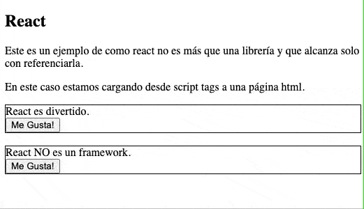
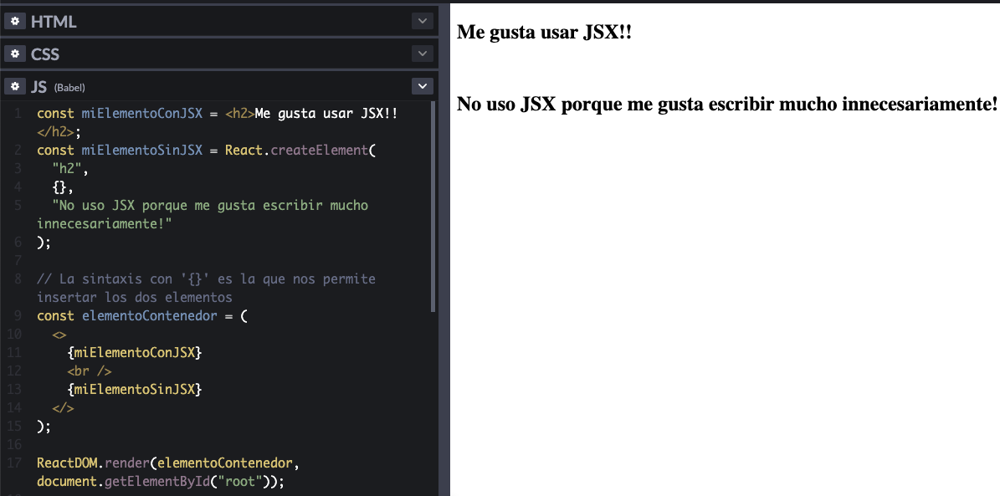
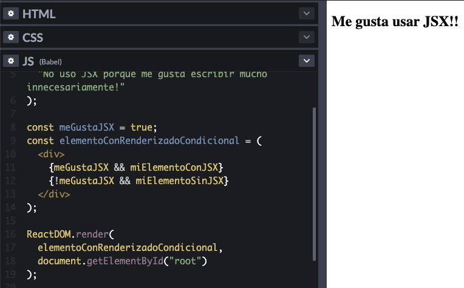
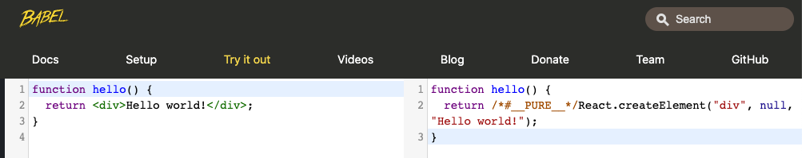

# React
>NOTA: A lo largo de este escrito va a haber ejemplos con referencias a 'codepen'. Codepen es una herramienta para compartir fragmentos de código, al acceder a los ejemplos con estos links, vas a poder ver y modificar el código, y ademas, los efectos de los cambios casi instantaneamente desde tu navegador.
## ¿Qué es React?
Según el [sitio oficial](https://reactjs.org/):
```
React es una librería de JavaScript para construir interfaces.
```
Esta simple definición es importarte para no perdernos, react  es una librería con el propósito de asistirnos en la creacion de vistas. 

En la practica se utiliza en conjunto a un montón de otros extras y herramientas lo que a veces lo hace parecer mucho más complejo e intimidante a la hora de aprender.

En su forma mas simple podemos utilizar react en una página html a través de tags `<script></script>` que referencien las librerias de `react` y `react-dom`. Luego tan solo tenemos que empezar a escribir nuestros componentes de react. 



> NOTA: El código fuente se puede ver [acá](ejemplos/react-html.html), tambien podés mirarlo en vivo en [CODEPEN](https://codepen.io/leandamarill/pen/poNWgmQ). Este  ejemplo se basa en el expuesto en la documentación sobre [como agregar react a un sitio existente](https://reactjs.org/docs/add-react-to-a-website.html#add-react-in-one-minute)

## JSX
Llegamos a nuestro primer `extra` de React. JSX significa JavaScript XML, su trabajo es producir 'elementos de React' que nos permite renderizarlos y colocarlos en el DOM de manera más sencilla. 

Podríamos considerarlo como [azúcar sintáctico](https://es.wikipedia.org/wiki/Az%C3%BAcar_sint%C3%A1ctico) para no utilizar alguna de las funciones de react directamente.

Es importante aclarar que no es estrictamente necesario utilizar JSX par ausar React, pero es MUY conveniente y en la práctica es practicamente imposible no verlos juntos.

#### Ejemplo con JSX
```js
const miElemento = <h1>Me gusta usar JSX!</h1>;

ReactDOM.render(miElemento, document.getElementById('root'));
```
#### Ejemplo sin JSX
```js
const miElemento = React.createElement('h1', {}, 'No uso JSX porque me gusta escribir mucho innecesariamente!');

ReactDOM.render(miElemento, document.getElementById('root'));
```

> NOTA: En ambos casos se utiliza la llamada a ReactDOM.render, esta simplemente se encarga de renderizar el primer elemento como hijo del segundo elemento del DOM (en ese caso se esta buscando el elemento con id 'root' que suele ser un `div` sin contenido).

### ¿Por qué JSX?

React acepta el hecho de que la lógica de renderizado está intrínsecamente unida a la lógica de la interfaz de usuario: cómo se manejan los eventos, cómo cambia el estado con el tiempo y cómo se preparan los datos para su visualización.

En lugar de separar artificialmente tecnologías poniendo el maquetado y la lógica en archivos separados, React separa [intereses](https://es.wikipedia.org/wiki/Separaci%C3%B3n_de_intereses) con unidades ligeramente acopladas llamadas `componentes` que contienen ambas.

### Lo bueno de usar JSX
Una ventaja de utilizar JSX es que podemos colocar cualquier expresión de JavaScript mediante el uso de llaves `{}`. Estas expresiones se evaluan y al momento de ser renderizadas lo que se visualiza es el resultado obtenido.

Por ejemplo, este página muestra siempre la hora en la que se renderizó:
```js
const element = <h1>Hola! La fecha en este momento es {new Date().toString()}</h1>;

ReactDOM.render(
  element,
  document.getElementById('root')
);
```
> [Expresiones en JSX - CODEPEN](https://codepen.io/leandamarill/pen/zYoEqPq)  

El uso de las llaves no solo esta limitado a expresiones de JavaScript sinó que tambien podemos devolver otros elementos de JSX. En la siguiente imagen componemos los dos elementos de ejemplos anteriores en no solo

```js
const miElementoConJSX = <h2>Me gusta usar JSX!!</h2>;
const miElementoSinJSX = React.createElement(
  "h2",
  {},
  "No uso JSX porque me gusta escribir mucho innecesariamente!"
);

// La sintaxis con '{}' es la que nos permite insertar los dos elementos
const elementoContenedor = (
  <div>
    {miElementoConJSX}
    <br />
    {miElementoSinJSX}
  </div>
);

ReactDOM.render(elementoContenedor, document.getElementById("root"));
```
> [JSX en JSX - CODEPEN](https://codepen.io/leandamarill/pen/gOLGrej)  



Un derivado de poder mostrar elementos JSX es poder elegir un componente u otro en base a lógica definida en JavaScript, este concepto lo vamos a escuchar nombrado como 'renderizado condicional'.

```js
const meGustaJSX = true;
const elementoConRenderizadoCondicional = (
  <div>
    {meGustaJSX && miElementoConJSX}
    {!meGustaJSX && miElementoSinJSX}
  </div>
);
```
> [Renderizado condicional en JSX - CODEPEN](https://codepen.io/leandamarill/pen/yLVzOyw)  



Además de los ejemplos que fuimos mencionando, JSX nos presenta algunas otras bondades como ayudarnos a prevenir vulnerabilidades XSS escapando contenido antes de renderizarlo. Estás no son relevantes para nosotros en este momento pero [acá](https://es.reactjs.org/docs/introducing-jsx.html) pueden leer un poco mas sobre JSX.

### Lo 'malo' de usar JSX

JSX tiene una desventaja que de no ser facilmente solucionable sería fatal.

```
JavaScript puro no sabe que hacer con JSX
```

Si bien algunos navegadores como versiones recientes de Chrome pueden llegar a entender nuestro JSX, para garantizar que todos lo navegadores puedan hacerlo necesitamos ayuda de un pre-procesador de JavaScript.

Uno de estos pre-procesadores es `Babel` que es capaz de convertir nuestro codigo en javascript puro



Algo a aclarar es que durante el cursado no configuraremos nada relacionado a babel ya que las herramientes utilizadas lo hacen por nosotros.

## Componentes

Ya hemos mencionado un par de veces la palabra `componentes`, esto se debe a que en React definimos nuestras vistas con una estrategia basada en componentes encapsulados que manejan su propio estado interno que se utilizan en conjunto para construir interfaces graficas complejas. 

Un componente no es mas qué una clase o función de JavaScript que acepta entradas o propiedades (o `props` como se suele abreviar) y retorna un elemento de React que describe como una sección de la interfaz gráfica debería verse.

Existen dos tipos de componentes
- Componente funcional
- Compoennete de clase

//TODO