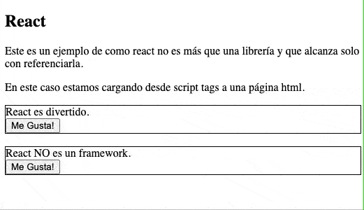

# React

## ¿Qué es React?
Según el [sitio oficial](https://reactjs.org/):
```
React es una librería de JavaScript para construir interfaces.
```
Esta simple definición es importarte para no perdernos, react  es una librería con el propósito de asistirnos en la creacion de vistas. 

En la practica se utiliza en conjunto a un montón de otros extras y herramientas lo que a veces lo hace parecer mucho más complejo e intimidante a la hora de aprender.

En su forma mas simple podemos utilizar react en una página html a través de tags `<script></script>` que referencien las librerias de `react` y `react-dom`. Luego tan solo tenemos que empezar a escribir nuestros componentes de react. 



> NOTA: El código fuente del ejemplo se puede ver [acá](ejemplos/react-html.html) y se basa en el expuesto en la documentación sobre [como agregar react a un sitio existente](https://reactjs.org/docs/add-react-to-a-website.html#add-react-in-one-minute)

### JSX
Llegamos a nuestro primer `extra` de React. JSX significa JavaScript XML y nos permite escribir elementos de html y colocarlos en el DOM de manera más sencilla. 

Podríamos considerarlo como [azúcar sintáctico](https://es.wikipedia.org/wiki/Az%C3%BAcar_sint%C3%A1ctico) para no utilizar alguna de las funciones de react directamente.

Es importante aclarar que no es estrictamente necesario utilizar JSX par ausar React, pero es MUY conveniente y en la práctica es practicamente imposible no verlos juntos.

#### Ejemplo con JSX
```
const miElemento = <h1>Me gusta usar JSX!</h1>;

ReactDOM.render(miElemento, document.getElementById('root'));
```
#### Ejemplo sin JSX
```
const miElemento = React.createElement('h1', {}, 'No uso JSX porque me gusta escribir mucho innecesariamente!');

ReactDOM.render(miElemento, document.getElementById('root'));
```

> NOTA: En ambos casos se utiliza la llamada a ReactDOM.render, esta simplemente se encarga de renderizar el primer elemento como hijo del segundo elemento del DOM (en ese caso se esta buscando el elemento con id 'root' que suele ser un `div` sin contenido).


### Componentes

Ya hemos mencionado un par de veces la palabra `componentes`, esto se debe a que en React definimos nuestras vistas con una estrategia basada en componentes encapsulados que manejan su propio estado interno que se utilizan en conjunto para construir interfaces graficas complejas. 

Un componente no es mas qué una clase o función de JavaScript que acepta entradas o propiedades (o `props` como se suele abreviar) y retorna un elemento de React que describe como una sección de la interfaz gráfica debería verse.

Existen dos tipos de componentes
- Componente funcional
- Compoennete de clase

Desde la recomendación